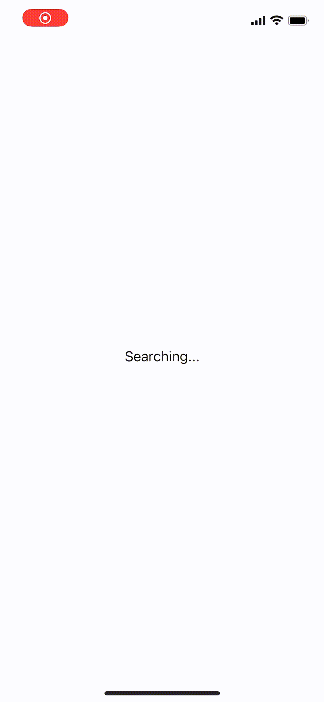

# Nearby Interaction
https://developer.apple.com/videos/play/wwdc2020/10110/

### Overview
Locate and interact with nearby devices using identifiers, distance, and direction.



#### Range, Orientation, and Line of Sight to interact with a nearby device

There are restrictions for NI to work best.
* Within nine meters of each other.
* In portrait orientation.
* Facing each other with their back camera.


https://developer.apple.com/documentation/nearbyinteraction/initiating_and_maintaining_a_session


I can get a unit vector that points from the user in the direction of the tracked object addition to a distance.
I can direction as a Cartesian triplet (x,y,z) in normalized units with a range of [0..1]. NI models direction as a coordinate on the unit sphere pointing toward the nearby object. The coordinate system is relative to the center of the device’s body. As the user looks at the device’s screen,

* The x-axis extends positively to the right.
* The y-axis extends positively upward.
* The z-axis extends negatively starting at the device and moving away from the user.


https://developer.apple.com/documentation/nearbyinteraction/ninearbyobject/3601347-direction


### Prepare
1. Add `NSLocalNetworkUsageDescription` to Info.plist<br>
A message that tells the user why the app is requesting access to the local network.
```
<key>NSNearbyInteractionAllowOnceUsageDescription</key>
<string>XXXXXXXXXXXXXXX</string>
```

2. Add `NSBonjourServices` to Info.plist<br>
Bonjour service types browsed by the app.
```
<key>NSBonjourServices</key>
<array>
	<string>_ni-demo._tcp</string>
</array>
```


### Flow


### Implement
1-2. startAdvertisingPeer / startBrowsingForPeers

```swift
let peerID = MCPeerID(displayName: UIDevice.current.name)
let appId = "com.sample.NearbyInteractionDemo"
let serviceType = "ni-demo"

let session = MCSession(peer: peerID, securityIdentity: nil, encryptionPreference: .required)
session.delegate = self

let advertiserDelegate = NearbyServiceAdvertiserDelegate(session: session)
// MEMO: serviceType needs to be 15 characters or fewer
let advertiser = MCNearbyServiceAdvertiser(peer: peerID, discoveryInfo: ["appId": appId], serviceType: serviceType)
advertiser.delegate = self

let browserDelegate = NearbyServiceBrowserDelegate(appId: appId, session: session)
let browser = MCNearbyServiceBrowser(peer: peerID, serviceType: serviceType)
browser.delegate = self

advertiser.startAdvertisingPeer()
browser.startBrowsingForPeers()
```

3. invitePeer

[MCNearbyServiceBrowserDelegate#browser(_:foundPeer:withDiscoveryInfo:)](https://developer.apple.com/documentation/multipeerconnectivity/mcnearbyservicebrowserdelegate/1406926-browser) is called when a nearby peer is found.
```swift
func browser(_ browser: MCNearbyServiceBrowser, foundPeer peerID: MCPeerID, withDiscoveryInfo info: [String : String]?) {
    browser.invitePeer(peerID, to: session, withContext: nil, timeout: 10)
}
```

4. receive invitation from peer

[MCNearbyServiceAdvertiserDelegate#advertiser(_:didReceiveInvitationFromPeer:withContext:invitationHandler:)](https://developer.apple.com/documentation/multipeerconnectivity/mcnearbyserviceadvertiserdelegate/1406971-advertiser) is called when an invitation to join a session is received from a nearby peer.
```swift
func advertiser(_ advertiser: MCNearbyServiceAdvertiser, didReceiveInvitationFromPeer peerID: MCPeerID, withContext context: Data?, invitationHandler: @escaping (Bool, MCSession?) -> Void) {
    invitationHandler(true, session)
}
```

5. send NIDiscoveryToken

  1. get `NIDiscoveryToken` from `NISession`
  2. send `NIDiscoveryToken` to connected peers using [MCSession#send(_:toPeers:with:)](https://developer.apple.com/documentation/multipeerconnectivity/mcsession/1406997-send)

```swift
let nisession = NISession()
nisession.delegate = self

guard
  let discoveryToken = nisession.discoveryToken,
  let data = try?  NSKeyedArchiver.archivedData(withRootObject: discoveryToken, requiringSecureCoding: true)
else {
  fatalError("failed to prepare discovery token.")
}

session.send(data, toPeers: session.connectedPeers, with: .reliable)
```

6. run NISession with NIDiscoveryToken

[MCSessionDelegate#session(_:didReceive:fromPeer:)](https://developer.apple.com/documentation/multipeerconnectivity/mcsessiondelegate/1406934-session) is called when NIDiscoveryToken is received from a nearby peer.

```swift
func session(_ session: MCSession, didReceive data: Data, fromPeer peerID: MCPeerID) {
  guard let discoveryToken = try? NSKeyedUnarchiver.unarchivedObject(ofClass: NIDiscoveryToken.self, from: data) else {
    fatalError("Unexpectedly failed to decode discovery token.")
  }
  let config = NINearbyPeerConfiguration(peerToken: discoveryToken)
  nisession.run(config)
}
```

7. update nearbyObjects

[NISessionDelegate#session(_:didUpdate:)](https://developer.apple.com/documentation/nearbyinteraction/nisessiondelegate/3601171-session) is called when the session updates nearby objects.

[NISessionDelegate#session(_:didRemove:reason:)](https://developer.apple.com/documentation/nearbyinteraction/nisessiondelegate/3601170-session) is called when the session removes one or more nearby objects.

```swift
func session(_ session: NISession, didUpdate nearbyObjects: [NINearbyObject]) {
  // get distance(Float?) and direction(simd_float3?) from NINearbyObject
}

func session(_ session: NISession, didRemove nearbyObjects: [NINearbyObject], reason: NINearbyObject.RemovalReason) {
}
```
